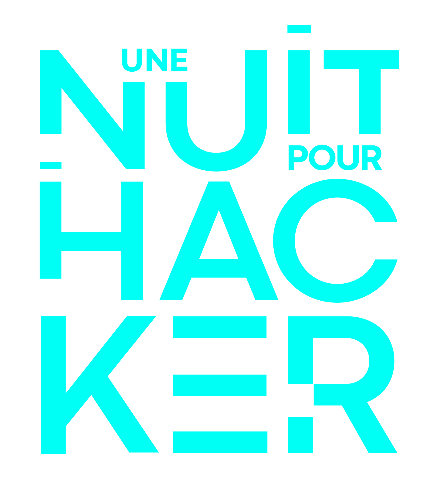

# Une Nuit Pour Hacker NHK26

<p align="center">
  
</p>

<p align="center">
  
  
  
  
  
  
</p>

Version conteneurisee de la plateforme CTF presentee lors de l'evenement **"Une Nuit Pour Hacker"** (NHK 2026), basee sur [CTFd](https://ctfd.io) avec un theme custom **Cybernoir**.

## Prerequis

- [Docker](https://docs.docker.com/get-docker/) (avec Docker Compose)
- Python 3
- Git

## Quick Start

```bash
git clone https://github.com/Mehdi-Zen/zen-nhk26-ctf.git
cd zen-nhk26-ctf

# Installation complete
./zen install

# Ou sans les challenges container (plus rapide)
./zen install --no-build
```

CTFd sera accessible sur `http://localhost:8000`.

> Le fichier `.env` est genere automatiquement au premier lancement avec des cles aleatoires.

## CLI zen

```bash
./zen install               # Premiere installation (up + setup + pull + deploy)
./zen install --no-build    # Installation sans images Docker
./zen up                    # Demarrer l'infrastructure
./zen down                  # Arreter
./zen restart               # Redemarrer
./zen setup                 # Configurer CTFd (interactif)
./zen pull                  # Pull les images pre-build depuis ghcr.io
./zen build                 # Build les images en local (alternative)
./zen deploy                # Deployer les challenges
./zen cleanup               # Supprimer tous les challenges
./zen validate              # Valider les challenge.yml
./zen status                # Status des services
./zen logs [service]        # Logs (defaut: ctfd)
./zen reset                 # Tout supprimer et repartir de zero
```

## Infrastructure

Le `docker-compose.yml` lance :
- **CTFd** avec le theme Cybernoir et les plugins
- **MariaDB Galera Cluster** (3 noeuds) + **MaxScale** (proxy readwritesplit)
- **Redis** (cache + sessions)
- **Nginx** (reverse proxy)
- **Registry Docker** (images des challenges)

## Challenges

80+ challenges organises dans `challenges/` par categorie :

| Categorie | Nombre |
|-----------|--------|
| Web | ~15 |
| Crypto | ~15 |
| Forensic | ~15 |
| Reverse | ~15 |
| OSINT | ~10 |
| SQLi | ~8 |
| Code Review | ~10 |
| Misc | ~10 |

Chaque challenge contient :
- `challenge.yml` — metadonnees, flag, scoring
- `Dockerfile` — image Docker (si container)
- `src/` — code source
- `files/` — fichiers distribues aux participants
- `WALKTHROUGH.md` — solution (certains challenges)

### Scoring dynamique

| Difficulte | Points | Decay | Minimum |
|-----------|--------|-------|---------|
| INTRO | 50 | 40 | 20 |
| FACILE | 100 | 30 | 50 |
| MOYEN | 300 | 13 | 100 |
| DIFFICILE | 500 | 6 | 300 |
| INSANE | 1000 | 3 | 500 |

## Theme Cybernoir

Theme custom dans `CTFd/themes/cybernoir/` :
- Design dark avec accents neon
- Animation First Blood avec son
- Scoreboard dual bracket (Chart.js)
- Tags visuels par difficulte
- Page d'accueil avec reglement et carrousel sponsors

## Plugins

### [Plugin Containers](https://github.com/TheFlash2k/containers)
- Deploiement Docker distant via SSH
- Flag unique par container
- Expiration automatique + extend
- First Blood sur challenges container (bonus 50% + animation SSE)

### Plugin First Blood
- Notification temps reel (Server-Sent Events)
- Animation overlay + son
- Bonus de points pour le premier solver

## Configuration du plugin Containers

Pour que les challenges container fonctionnent, configurez le plugin dans **Administration → Plugins → Containers → Settings** :

1. Renseignez le **Docker Base URL** : `unix:///var/run/docker.sock` (local) ou `ssh://user@host` (distant)
2. Renseignez le **hostname** : `localhost` pour tester en local
3. Cliquez **Submit**  le status doit passer en **Reachable** (vert)

Pour plus d'infos sur le plugin : [github.com/TheFlash2k/containers](https://github.com/TheFlash2k/containers)

> **⚠️ Work in progress**  La documentation et les walkthroughs des challenges sont en cours de redaction. Ils arriveront tres prochainement !

## Inspirations

- [CTFd](https://github.com/CTFd/CTFd)  La plateforme CTF open source
- [TheFlash2k/containers](https://github.com/TheFlash2k/containers) — Plugin de challenges containerises
- [PwnTheMall](https://github.com/pwnthemall/pwnthemall) les cracks 

## Licence

Base sur [CTFd](https://github.com/CTFd/CTFd) (Apache 2.0).

## Credits

Organise par l'equipe NHK26 — Avignon, Mars 2026.
